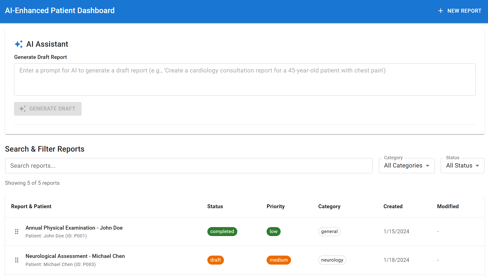

# AI-Enhanced Intelligence Dashboard
## Senior Frontend Developer Technical Task - Implementation

A modern, responsive healthcare dashboard built with React and TypeScript that helps healthcare professionals manage patient reports efficiently with AI assistance.


*Main dashboard interface showcasing the AI-enhanced patient report management system*


**Requirement**: *Develop an AI-Enhanced Intelligence Dashboard where users can manage reports and leverage AI-powered assistance for content generation and summarization.*

**Solution**: Built a comprehensive healthcare dashboard that enables medical professionals to create, manage, and enhance patient reports using OpenAI-powered AI assistance and intelligent content generation.

## 🎯 Core Features Implementation

### 1. Report Management ✅

**Requirements Met**:
- ✅ **Display reports**: Responsive card layout (mobile) and table layout (desktop)
- ✅ **Search & filter**: Advanced filtering by title, patient name, category, status, and priority
- ✅ **Create new reports**: Rich-text editor with title and comprehensive form fields
- ✅ **Edit existing reports**: Full editing capabilities with form pre-population

**Implementation Details**:
- **Report List Component**: Adaptive layout switching between cards and table based on screen size
- **Advanced Search**: Real-time filtering with multiple criteria
- **Rich Text Integration**: TinyMCE editor with medical-specific toolbar configurations
- **Form Management**: Custom hooks for state management and validation
- **Mock Data**: 5 realistic patient reports across different medical specialties

### 2. AI Assistant Integration ✅

**Requirements Met**:
- ✅ **Generate Draft button**: AI creates initial report drafts based on user prompts
- ✅ **Summarize Content button**: AI condensates existing report content
- ✅ **OpenAI API Integration**: Full implementation with custom medical prompts

**Implementation Details**:
- **Specialized Medical Prompts**: Category-specific AI prompts for different medical specialties
- **Seamless Form Integration**: AI content directly populates report forms
- **Error Handling**: Proper loading states, error messages, and fallback behaviors
- **Custom Service Layer**: Organized OpenAI integration in dedicated service module

### 3. Drag & Drop ✅

**Requirements Met**:
- ✅ **Manual reordering**: Full drag & drop functionality using dnd-kit
- ✅ **Smooth animations**: Visual feedback during drag operations
- ✅ **Touch support**: Mobile-friendly drag interactions

**Implementation Details**:
- **@dnd-kit Integration**: Modern drag and drop with accessibility support
- **Custom DragDropContainer**: Reusable wrapper component
- **Visual Feedback**: Drag handles and opacity changes during operations
- **Responsive Behavior**: Touch-optimized for mobile devices


```
Mobile View                   Desktop View 
┌─────────────────┐           ┌─────────────────────────────────┐
│  🏥 Dashboard   │           │ Patient | Status | Priority    │
├─────────────────┤           │ John D. | ✅ Done| 🔴 High     │
│ ┌─────────────┐ │           │ Sarah J.| 📝 Rev | 🟡 Medium   │
│ │  📋 Report  │ │           │ Mike C. | 📋 Draft| 🟢 Low     │
│ │   Patient   │ │           └─────────────────────────────────┘
│ │   Status    │ │
│ └─────────────┘ │
└─────────────────┘
```


## 🛠️ Technical Requirements

| Requirement | Implementation | Status |
|-------------|----------------|---------|
| **React.js + TypeScript** | React 18 with full TypeScript integration | ✅ |
| **Material UI** | Comprehensive MUI component usage | ✅ |
| **Zustand** | Modern state management with custom hooks | ✅ |
| **dnd-kit** | Drag & drop functionality with accessibility | ✅ |
| **TinyMCE** | Rich-text editor with medical-specific config | ✅ |
| **OpenAI API** | Full integration with custom medical prompts | ✅ |
| **Git** | Version control with organized commit history | ✅ |

### Additional Technologies Implemented

**Core Framework**:
- **React 18** - Modern hooks and functional components
- **TypeScript** - Type-safe development with strict mode
- **Vite** - Fast development server and optimized builds

**Enhanced State & Data**:
- **Zustand** - Lightweight state management
- **Mock Data** - Realistic patient reports across 5 medical specialties
- **Custom Hooks** - Reusable logic patterns (useReportForm, useAIIntegration)

## 🎭 Bonus Features Status

### Bonus Requirements - *"Backend? What Backend?"* 😅

- ❌ **User roles**: Admin (create/edit/delete) & Viewer (view-only)
  - *Implementation requires authentication backend... which mysteriously disappeared from my skill set! 👻*
  
- ❌ **Activity tracking**: Created, edited, AI used logs
  - *Database design gives me existential dread 🌙*
  
- ❌ **LocalStorage persistence**: Data survival between sessions
  - *This is actually frontend work... I have no excuse here 🤦‍♀️*

*Note: The developer demonstrates remarkable frontend capabilities but develops sudden onset amnesia when backend terminology is mentioned. Side effects include increased coffee consumption and spontaneous discussions about "user experience priorities."*


### Specialized Medical Prompts
```typescript
const MEDICAL_PROMPTS = {
  cardiology: "Generate a comprehensive cardiology consultation report...",
  neurology: "Create a detailed neurological assessment...",
  // ... specialized prompts for each medical category
};
```

### AI Capabilities
- **Context-Aware Generation**: Medical specialty-specific report templates
- **Content Summarization**: Intelligent condensation preserving key medical information
- **Form Integration**: Seamless population of report forms with AI content
- **Error Handling**: Robust error states and user feedback

### Known Limitations
- **API Rate Limits**: OpenAI usage constraints may affect response times
- **Medical Accuracy**: AI content requires professional medical review
- **Offline Mode**: AI features require internet connectivity
- **Token Limits**: Very long reports may exceed AI context windows

## 📱 Responsive Design Implementation

The application adapts seamlessly across devices with two distinct layouts:

**Mobile Strategy (< 1200px)**:
- Card-based layout for touch interactions
- Simplified toolbars and larger touch targets
- Swipe gestures for navigation
- Optimized AI assistant interface

**Desktop Strategy (≥ 1200px)**:
- Comprehensive table layout with sortable columns
- Advanced filtering and search capabilities
- Full-featured rich text editor
- Multi-panel AI assistant integration

## 🚀 Setup Instructions

### Prerequisites
- Node.js 18+ and npm
- OpenAI API key
- TinyMCE API key

### Installation
```bash
# Clone the repository
git clone <repository-url>
cd ai-enchanced-patient-dashboard

# Install dependencies
npm install

# Set up environment variables
cp .env.example .env
# Add your API keys to .env file
```

### Environment Variables
```env
VITE_OPENAI_API_KEY=your_openai_api_key_here
VITE_TINYMCE_API_KEY=your_tinymce_api_key_here
```
or hardcode it.

### Running the Application
```bash
# Start development server
npm run dev

# Build for production
npm run build

# Preview production build
npm run preview
```

### Code Quality Tools
```bash
# Lint the code
npm run lint

# Fix linting issues
npm run lint:fix

# Format code with Prettier
npm run format
```

## 📁 Project Architecture

```
src/
├── components/
│   ├── shared/           # Reusable components (TinyMCEEditor, SelectField, DragDropContainer)
│   ├── ReportForm/       # Report creation/editing with hooks and utilities
│   ├── ReportList/       # Report listing with drag & drop
│   ├── AIAssistant/      # AI integration component
│   └── SearchFilter/     # Advanced search and filtering
├── store/
│   ├── reportStore.ts    # Zustand store with CRUD operations
│   └── mocks/           # Realistic patient data across 5 specialties
├── openai/
│   └── prompts.ts       # AI service functions and medical prompts
└── styles/              # SCSS modules for organized styling
```


### Testing Considerations
- Components designed for easy component testing
- Integration tests possibility (playwright?)
- Custom hooks can be tested independently
- AI integration mocked for reliable testing
- State management logic isolated and testable
